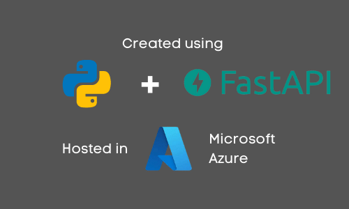

# Cari Tahu API



You can access it directly to [Demo](https://uneroapi.azurewebsites.net/), or clone this repository (local development):

## Local Development

Start the API service with command:

```bash
uvicorn main:app 
```

or with parameter reload to help development:

```bash
uvicorn main:app --reload
```
